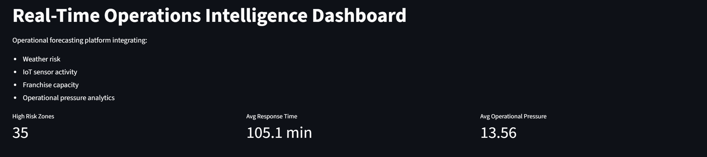
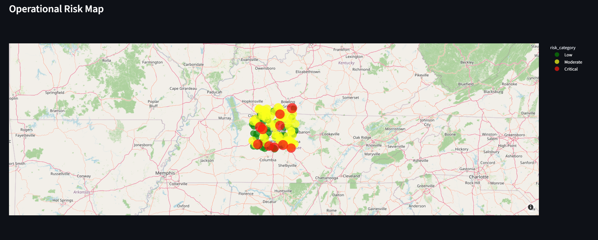
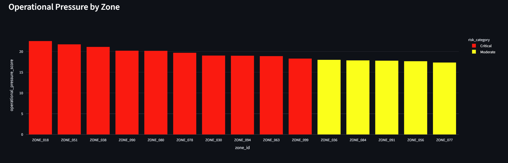
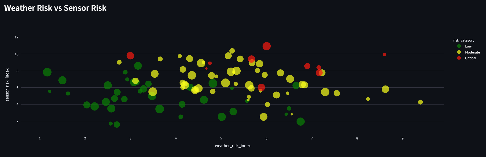
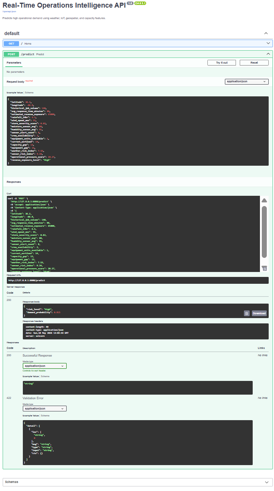

# Real-Time Operations Intelligence Platform  
### AI-Driven Operational Forecasting | Geospatial Analytics | FastAPI | Streamlit

---

## Overview

The Real-Time Operations Intelligence Platform is an end-to-end operational analytics and machine learning system designed to forecast high-demand service zones during weather-related events and operational disruptions.

The platform integrates simulated weather feeds, geospatial intelligence, IoT sensor activity, franchise resource capacity, and operational forecasting models to support proactive decision-making and resource allocation.

This project demonstrates how modern AI and analytics workflows can support real-time operational intelligence in industries such as emergency response, disaster recovery, logistics, healthcare operations, and enterprise field services.

---

## Business Problem

Organizations operating in dynamic environments often struggle to determine:

- Where operational demand will increase
- Which service zones are at highest risk
- How to allocate crews and equipment efficiently
- How to proactively respond before operational bottlenecks occur

This platform addresses those challenges by combining operational analytics, machine learning, geospatial modeling, and real-time forecasting into a centralized decision-support workflow.

---

## Key Features

- Real-time operational demand forecasting
- Weather risk analytics
- Geospatial intelligence and risk mapping
- IoT sensor simulation and monitoring
- Operational pressure scoring
- Franchise capacity analysis
- FastAPI prediction service
- Streamlit dashboard for operational visibility
- Machine learning classification pipeline
- Risk-based operational recommendations

---

## Tech Stack

### Data Science & Machine Learning
- Python
- Pandas
- NumPy
- Scikit-learn

### Deployment & APIs
- FastAPI
- Uvicorn

### Dashboard & Visualization
- Streamlit
- Plotly

### Geospatial & Operational Analytics
- GeoPandas
- Folium

### Engineering & Workflow
- Joblib
- Git/GitHub
- Virtual Environments

---

## System Architecture

```text
Weather Data + IoT Simulation + Job Logs + Franchise Capacity
                         ↓
              Data Ingestion & Validation
                         ↓
              Feature Engineering Pipeline
                         ↓
              ML Demand Forecasting Model
                         ↓
              FastAPI Prediction Service
                         ↓
              Streamlit Operations Dashboard
                         ↓
              Decision Support & Alerts
```           

 
## Machine Learning Objective

The machine learning model predicts whether a geographic service zone is likely to experience:
High operational demand within the next 24 hours
The model evaluates operational risk using:
- weather severity
- rainfall intensity
- wind speed
- sensor activity
- workload pressure
- crew availability
- equipment capacity
- historical service demand

## Operational Features Engineered

Key engineered features include:
- weather_risk_index
- sensor_risk_index
- operational_pressure_score
- capacity_gap
- equipment_gap
- historical_job_volume
- avg_response_time_minutes
- estimated_revenue_exposure

## Dashboard Capabilities

The Streamlit dashboard provides:
- Real-time operational risk visualization
- Geospatial demand mapping
- High-risk service zone identification
- Operational pressure analytics
- Weather vs sensor risk analysis
- Resource allocation visibility
- Interactive operational intelligence reporting

## Dashboard Overview


---

## Operational Risk Map


---

## Operational Pressure Analytics


---

## Weather vs Sensor Risk Analysis


---

## FastAPI Deployment


## API Deployment

The system includes a production-style FastAPI deployment for real-time operational forecasting.

### Example Endpoint
POST /predict

### Example Response
{
  "risk_level": "High",
  "demand_probability": 0.915
}

## Example Operational Use Cases

This platform can support:
- Disaster recovery operations
- Emergency response coordination
- Resource staging decisions
- Operational forecasting
- Crew allocation optimization
- Risk-based prioritization
- Enterprise field service analytics
- Infrastructure response planning

## Repository Structure

```text
real-time-operations-intelligence-platform/
│
├── data/
│   ├── raw/
│   ├── processed/
│   └── simulated/
│
├── models/
│
├── notebooks/
│
├── outputs/
│   ├── figures/
│   ├── maps/
│   └── reports/
│
├── src/
│   ├── generate_data.py
│   ├── feature_engineering.py
│   ├── train_model.py
│   ├── predict.py
│   ├── api.py
│   └── dashboard.py
│
├── README.md
├── requirements.txt
└── .gitignore
```
## Future Enhancements

# Planned future improvements include:
- Live weather API integration
- Automated retraining pipeline
- Real-time streaming ingestion
- Docker containerization
- Cloud deployment
- Alerting and notification system
- SHAP explainability integration
- Automated monitoring and drift detection

## Author

Mohammad Samad
Data Scientist | AI & Operational Intelligence | Predictive Analytics | Operations Research

GitHub: https://github.com/msamad08
